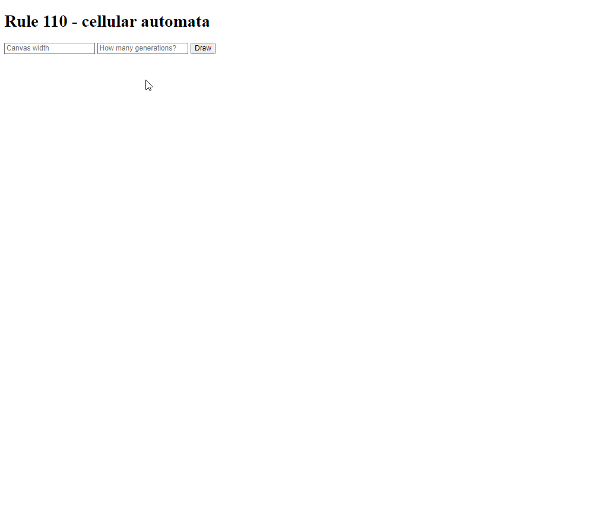
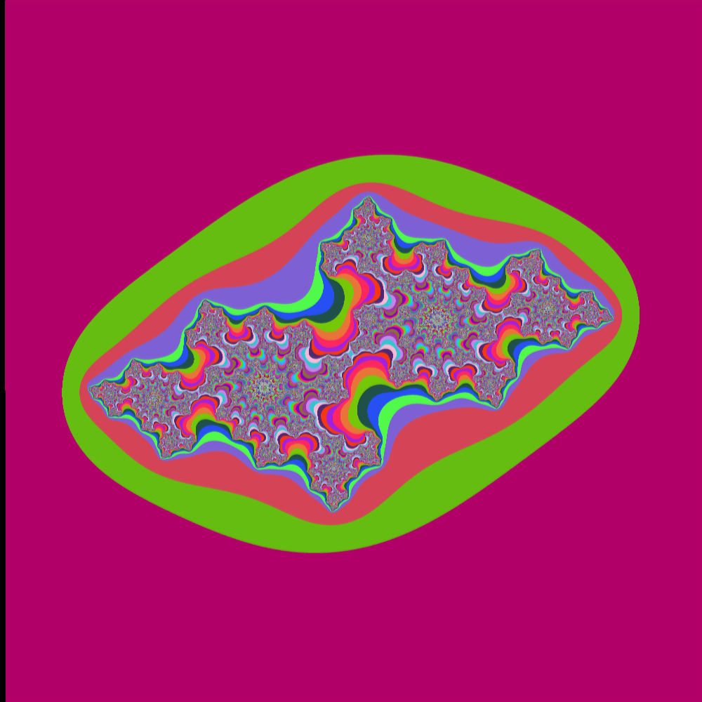
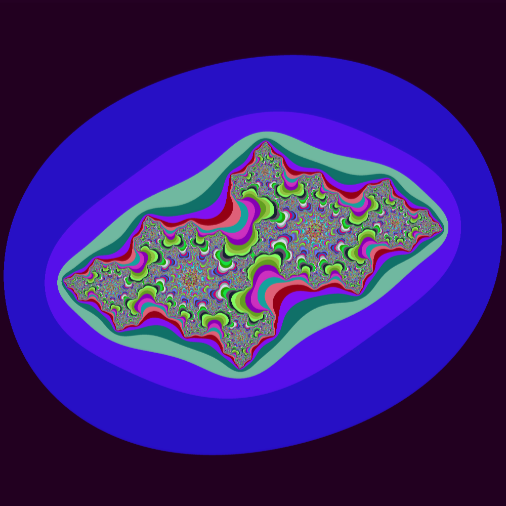
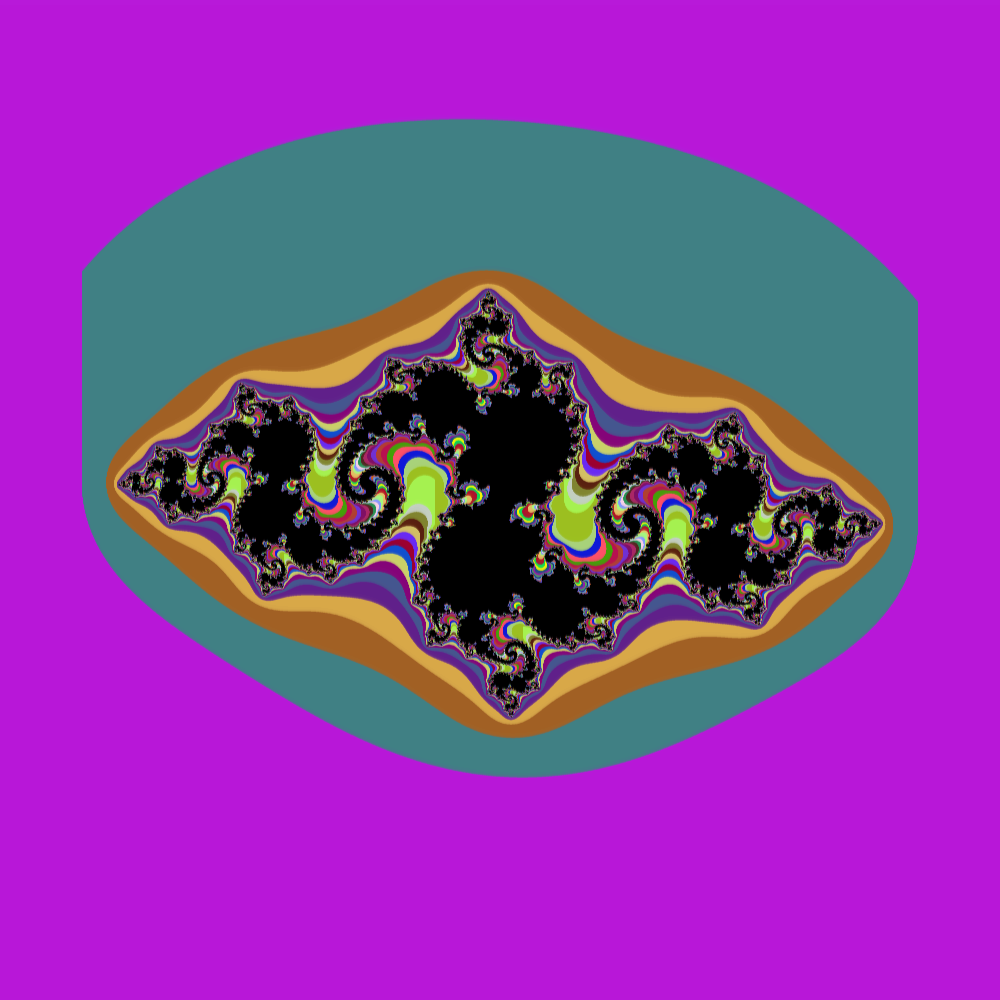
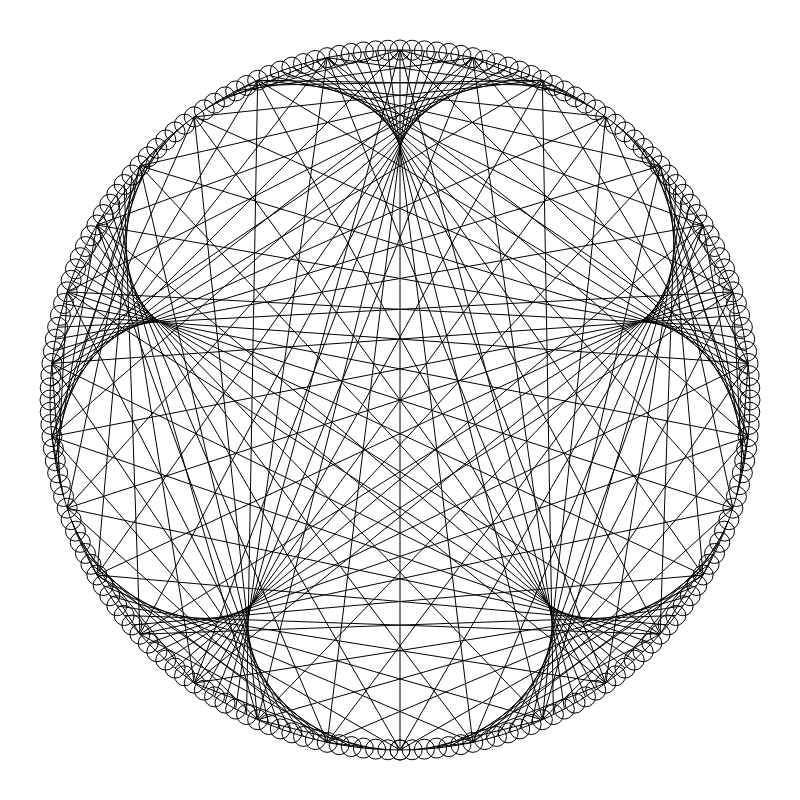
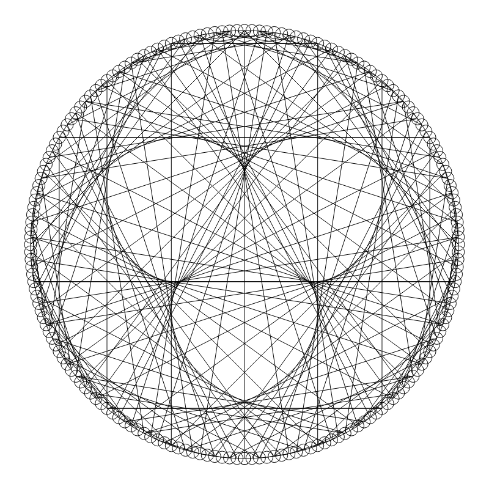
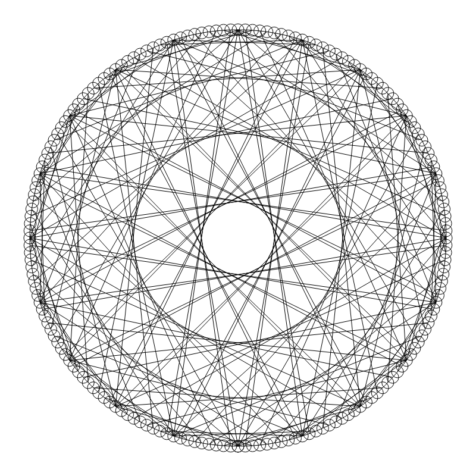
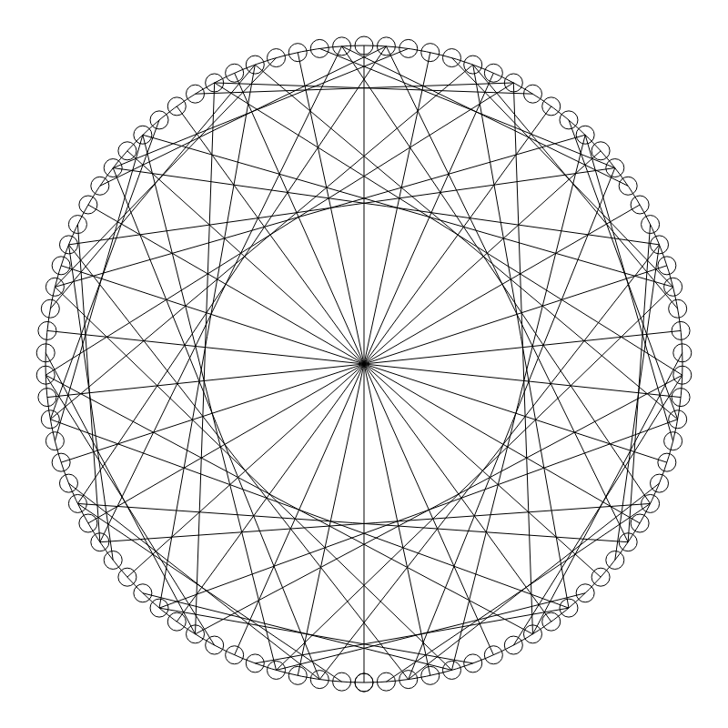

# Fractals and some visualizations

### [Rule 110](./rule110/)

### [Mandelbrot set](./mandelbrot/)

### [Julia set](./julia_sets/)

### [Times Table](./times_table/)

Some examples:

(till=180, times=6)

(till=180, times=62)

(till=180, times=81)

(till=90, times=106)

### [Diastic Machine](./diastic_machine/)